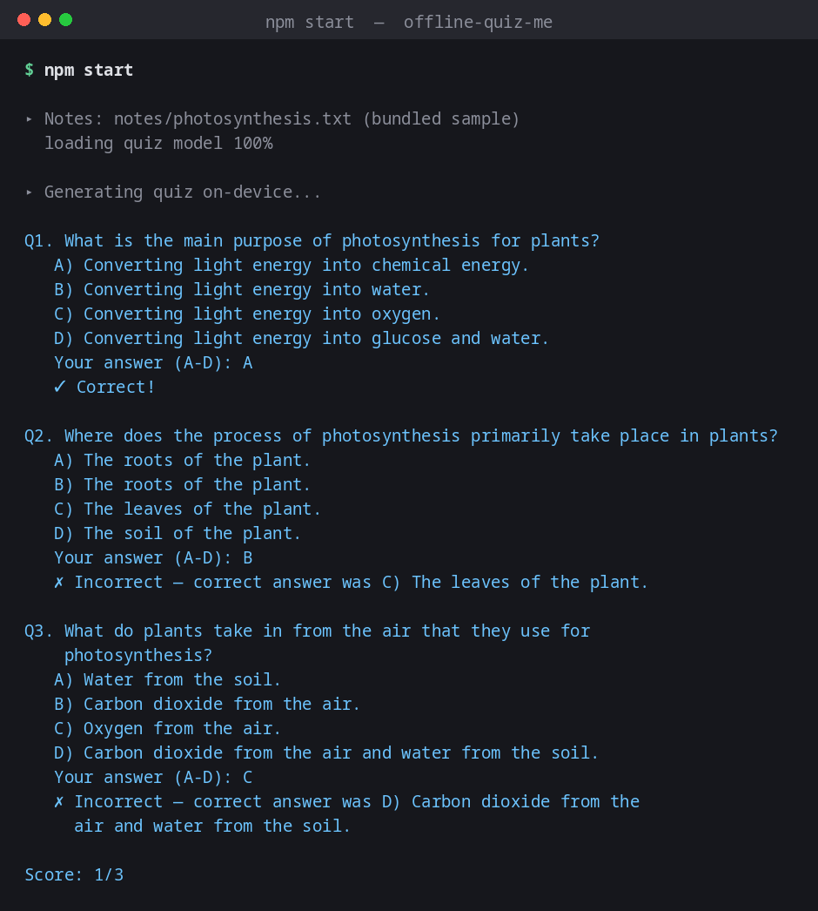

# Offline Quiz Me

A CLI study tool that turns your notes into a multiple-choice quiz and grades you on it — entirely **on-device**, powered by [Tether's QVAC SDK](https://github.com/tetherto/qvac).

No API key. No usage bill. Your notes never leave your machine.



## What it does / which QVAC function it calls

Point it at a notes file and it generates 3 multiple-choice questions from it, asks them one at a time in the terminal, and scores your answers. It calls QVAC's `loadModel()` to load a small local LLM (`LLAMA_3_2_1B_INST_Q4_0`) and `completion()` with a JSON schema `responseFormat`, so the model's output is constrained to valid `{question, options, correctAnswer}` JSON instead of free-form text that would need fragile parsing.

## Why I built it

Making your own flashcards from notes is tedious, and most "AI quiz generator" tools want you to paste your notes into a web form first. This generates the quiz locally from a plain text file, so whatever you're studying — including notes you might not want on a random SaaS company's server — stays on your machine.

## Requirements

- Node.js 18+
- ~770 MB free disk (1B-parameter LLM, downloaded once and cached)

## Install

```bash
git clone https://github.com/Nafree1/qvac-quiz-me.git
cd qvac-quiz-me
npm install
```

SDK used: **`@qvac/sdk` `^0.19.1`** (tested against `0.19.1`).

## Run

Quiz yourself on the bundled sample notes (a short explanation of photosynthesis):

```bash
npm start
```

Quiz yourself on your own notes:

```bash
node src/index.js /path/to/notes.txt
```

Answer each question with `A`, `B`, `C`, or `D` and press Enter.

```
Q1. What is the main purpose of photosynthesis for plants?
   A) Converting light energy into chemical energy.
   B) Converting light energy into water.
   C) Converting light energy into oxygen.
   D) Converting light energy into glucose and water.
   Your answer (A-D): A
   ✓ Correct!

Q2. Where does the process of photosynthesis primarily take place in plants?
   A) The roots of the plant.
   B) The roots of the plant.
   C) The leaves of the plant.
   D) The soil of the plant.
   Your answer (A-D): B
   ✗ Incorrect — correct answer was C) The leaves of the plant.
...
Score: 1/3
```

The first run downloads the model (~770 MB) and shows a progress bar; every run after that is instant and fully offline since the model is cached on disk.

**Small-model honesty:** this uses a 1B-parameter model for speed, not accuracy, and it's not perfect. An earlier version of this app asked the model to self-report which option index (0-3) was correct, and that index was frequently wrong even when the options themselves were fine — repeated testing showed it picking the wrong slot more often than not. The fix: the model now names the correct option's *text* (`correctAnswer`) instead of counting a slot number, and the app matches that text back to the displayed option itself. That fixed the mechanical bug — whatever the model claims is correct now reliably matches what's shown as correct — but the model can still occasionally pick an answer that's debatable or outright wrong on the merits (see Q2 above, where "The roots of the plant." appears twice — a duplicate-option case this version still can't fully rule out). The app also detects and retries when the model collapses into placeholder options like "a)", "b)", "c)", "d)" instead of real content, which happens occasionally. Read the generated questions with a little skepticism, the same way you would a first-draft flashcard.

## How it works

- `src/index.js` — the whole app. `generateQuiz()` calls `completion()` with a JSON schema constraining the output shape, retrying up to 3 times if the result looks degenerate (placeholder or duplicate options); `resolveCorrectIndex()` then matches the model's `correctAnswer` text back to one of the 4 displayed options (exact match, falling back to substring containment) rather than trusting a self-reported index. The quiz loop reads answers via a single shared async iterator over stdin (not repeated `rl.question()` calls, which can silently drop lines when several arrive in the same burst) and tallies the score.
- `notes/photosynthesis.txt` — a short, original sample notes file.
- `qvac.config.json` — quiets the SDK's own console logging so the CLI output stays readable.

## License

MIT, see [LICENSE](./LICENSE).
